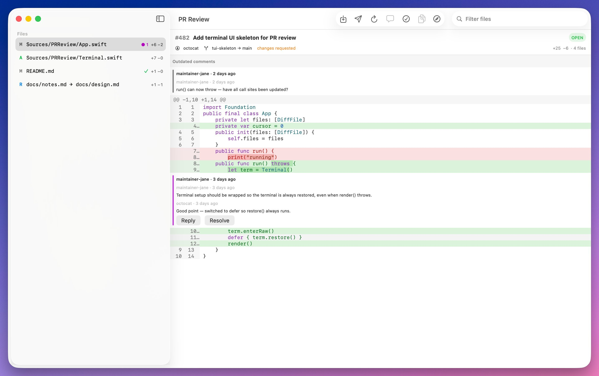

# review-man

A native macOS app for reviewing GitHub pull requests. Read the diff, comment
on lines, reply to threads, resolve, approve or request changes, all anchored
to the authenticated `gh` CLI.



> **Status**: the desktop app is implemented end-to-end. The original terminal
> UI has been removed. Remaining release gates (Developer ID signing,
> notarization, clean-account Finder testing, and actual macOS 13 testing) are
> external.

## Desktop app

`PR Review.app` is a native SwiftUI application built by Swift Package Manager
(Apple Silicon). One resizable window per pull request, with multiple PRs in
separate windows and no duplicates for the same repository + PR.

- **Read the diff** with SF Mono, fixed line-number gutters, horizontal
  scrolling, syntax coloring, and word-level change highlighting.
- **Comment inline**: click a line and add a draft (deleted lines become
  LEFT-side comments), or Shift-click for a multi-line range comment. Drafts
  are edited and deleted in place, with Undo/Redo, and persist automatically.
- **Threads**: expand, reply (retryable on failure), resolve/unresolve with
  optimistic updates and rollback.
- **Review**: comment, approve, or request changes with a summary; orphaned
  drafts (whose anchor left the diff) are excluded from submission and
  reattach automatically when their line returns.
- **File sidebar** with native search, status letters, ± counts, comment
  badges, and locally-persisted viewed marks.
- **`gh` onboarding**: the app discovers `gh` from your PATH, Apple Silicon
  Homebrew, or MacPorts (or a user-selected executable) and shows actionable
  status for missing, unauthenticated, expired, or under-scoped
  installations — without ever invoking a login shell.
- Full native menus and shortcuts, dark/light + high-contrast appearance,
  reduced-motion and reduced-transparency handling, and VoiceOver labels.

### Build and run the app

```sh
git clone https://github.com/namuan/review-man.git
cd review-man
make app     # debug build at build/PR Review.app
make run     # build + launch
make demo    # build + launch the offline load-test demo (250 files / 40k lines)
make app CONFIG=release   # release build
```

`make app` runs `swift build` and `scripts/build-app`, which assembles the
`.app` bundle, Info.plist, and `.icns` icon. It does not invoke `xcodebuild` or
`xcodegen`. To package without Make:

```sh
bash scripts/build-app release
```

To compile only the app executable (without a `.app` bundle):

```sh
swift build --configuration release --product PRReviewApp
```

The app registers the `pr-review://` URL scheme. `open pr-review://open/owner/repo/123`
opens or focuses that PR's window.

### The `pr-review` launcher

The `pr-review` executable is a thin desktop launcher: it resolves a PR
reference and hands it to the app through the `pr-review://` scheme.

```sh
make launcher               # builds .build/release/pr-review
pr-review https://github.com/owner/repo/pull/123   # full URL
pr-review owner/repo#123                           # shorthand
pr-review 123                                      # current repo, bare number
pr-review --demo                                   # open the app in demo mode
pr-review --help                                   # usage
pr-review --version                                # version
```

> The app must have been launched once so macOS registers the `pr-review://`
> scheme (the Makefile's `make app` / `make run` does this).

## Features

- **Full unified-diff engine** (parsed locally): added/deleted/modified/renamed
  files, binary files, hunk headers with context, correct old/new line numbers,
  word-level intra-line change highlighting, and a per-file "diff too large"
  fallback when the raw diff endpoint fails.
- **Syntax highlighting** for ~17 languages (Swift, Go, Rust, Python, JS/TS,
  C/C++, Java, Kotlin, Ruby, shell, JSON, YAML, TOML, SQL, HTML…), cached per
  language and content with bounded growth.
- **Inline comment threads** anchored to their lines, with LEFT-side (deleted
  line) support, resolved state, and outdated-thread sections.
- **Draft comments** with multi-line editing, multi-line range comments, and
  **automatic persistence to disk** — drafts survive crashes and restarts and
  survive head-SHA changes (valid anchors are kept, invalid ones are marked
  orphaned and excluded from submission until they reattach).
- **Submit**: comment / approve / request-changes, anchored to the head commit
  SHA; submissions reject 422s when the head moved (refresh re-fetches and
  re-anchors).
- **Demo mode with load testing**: `make demo` opens a synthetic monorepo-scale
  PR (250 files / 40k changed lines by default) so the whole pipeline — parse,
  anchor validation, sidebar search, hunk navigation, threads, highlighting —
  can be exercised offline at large scale. Named tiers and fully custom sizes
  are available (see [Demo load testing](#demo-load-testing)).

## Demo load testing

`make demo` launches the app in offline demo mode and opens a synthetic
load-test PR. It needs no `gh`, no network, and no persistence — everything is
generated deterministically, so the same command always opens the same PR.

| Scale    | Files | Changed lines | Typical PR                        |
|----------|------:|--------------:|-----------------------------------|
| `small`  |     4 |            31 | Curated sample (welcome button)   |
| `medium` |    50 |        10,000 | A busy feature PR                 |
| `large`  |   250 |        40,000 | A wide refactor / module split    |
| `xlarge` |   800 |       120,000 | A full monorepo migration         |

```sh
make demo                                            # large (default)
open "build/PR Review.app" --args --demo
open "build/PR Review.app" --args --demo --demo-scale xlarge
open "build/PR Review.app" --args --demo --demo-files 500 --demo-lines 60000
```

- The PR header stats (additions/deletions/changed files) are computed from the
  generated diff, so they always match what you see.
- Review threads are spread across files and anchored on real added lines, so
  thread navigation and inline replies are exercised at scale.
- The welcome screen's **Open demo** button keeps the tiny `small` sample for
  quick onboarding; `--demo` is the load-test path.
- Run `make bench` for release-mode parse/row-build/highlight timings
  (`PRReviewBench --fixture 50000 --files 250 --runs 3`), or `make smoke` for a
  headless debug-build timing sweep across `medium`/`large`/`xlarge`.

## Requirements

- macOS 13+ on Apple Silicon with a Swift 5.9+ toolchain and the macOS SDK.
- The [GitHub CLI](https://cli.github.com/) (`gh`) installed and authenticated:
  `brew install gh && gh auth login` (needs `repo` scope).

## Design notes

- **Drafts are local until you submit.** They are persisted to
  `~/Library/Application Support/pr-review/` keyed by `owner_repo_number_sha`
  and restored when you reopen the same head.
- **Replies are sent immediately** (GitHub's reply API has no pending-review
  batching). Only top-level comments are submitted as one review.
- **Viewed marks are local only** (per head SHA); they are not pushed to GitHub.
- **LEFT-side comments** use old-file line numbers; **RIGHT-side** use new-file
  line numbers, exactly as the GitHub API requires.
- **Orphaned drafts**: when a head changes and a draft's line disappears, the
  draft is marked orphaned, excluded from submission, and shown in its own
  section; it reattaches automatically if its anchor returns.
- **`gh` discovery**: inherited PATH, then Apple Silicon Homebrew and MacPorts,
  or an explicitly selected executable; health is checked with `gh --version`,
  `gh auth status`, and a minimal authenticated API request.

## Testing

```sh
swift test   # 156 unit tests: diff parser, word diff, highlighter, row/payload
             # builders, draft persistence, async cancellation + ordering,
             # head-SHA migration + orphans, syntax cache, dependency health,
             # desktop store/workflows/commands, launcher + URL handling
```

`PRReviewAppUITests` is an optional Xcode/XCTest UI-test harness for the
packaged app; it is not part of the SwiftPM build or test path. `PRReviewBench`
(release mode) generates 10k/50k/100k line synthetic diffs and measures the
large-diff acceptance targets.

## Project layout

```text
Sources/
  PRReviewKit/          reusable core (diff, highlight, GitHub, persistence,
                        review operations, launcher parsing)
  PRReviewDesktop/      SwiftUI app: store, workflows, views, commands, themes
  pr-review/            desktop launcher executable (pr-review:// handoff)
PRReviewApp/            SwiftPM app executable and bundle resources
scripts/build-app       SwiftPM build + macOS app-bundle packager
PRReviewAppUITests/     optional Xcode/XCTest UI tests
PRReview.xcodeproj/     optional Xcode project (xcodegen project.yml)
Tests/
  PRReviewKitTests/     core unit tests
  PRReviewDesktopTests/ desktop store/workflow/command unit tests
```

## License

MIT — see [LICENSE](LICENSE).
