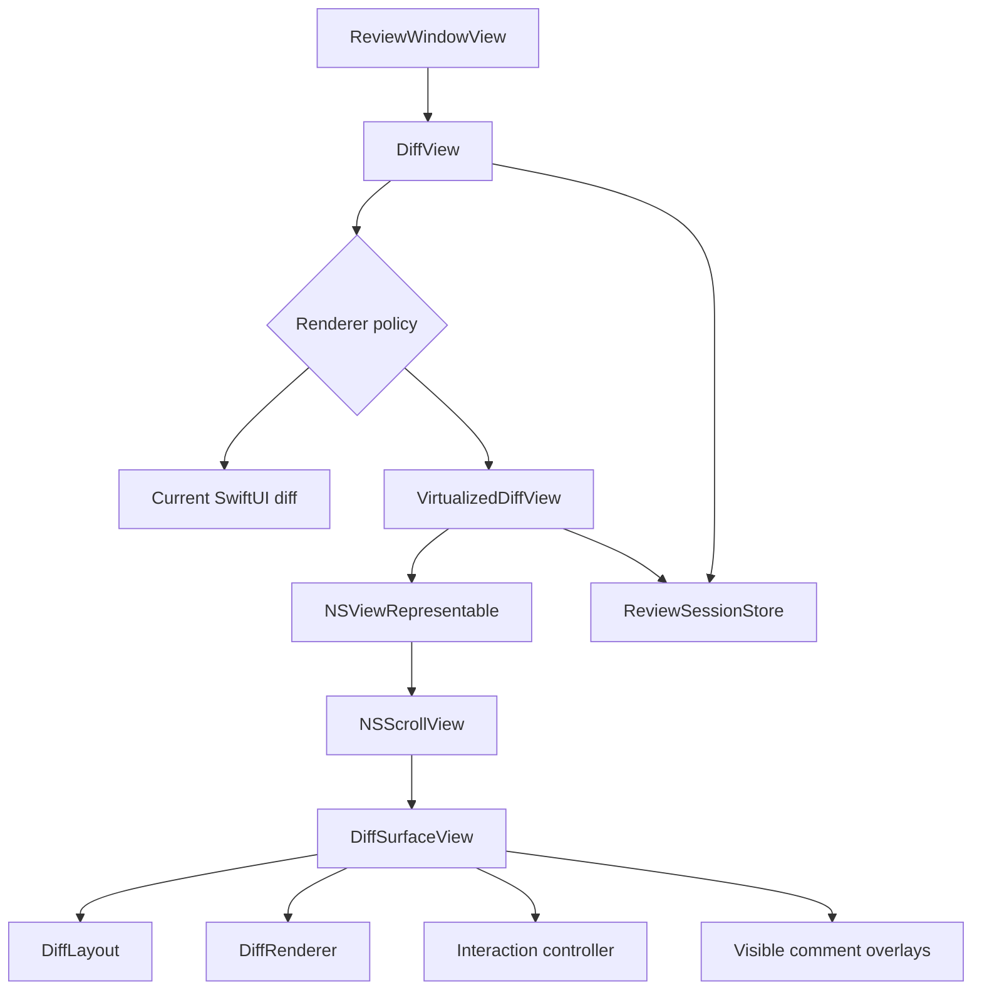

# AppKit-backed virtualized diff plan

Status: exploratory. Phases 1–6 and the AppKit-default rollout are in place. The custom AppKit surface is the default diff renderer; `--swiftui-diff` remains an explicit fallback.

## Phase 1 instrumentation

The current renderer now emits `os_signpost` intervals for:

- diff parsing
- demo fixture construction
- presentation construction
- file selection to first interactive diff frame
- draft editor presentation
- keyboard navigation

Run the headless baseline with:

```sh
make baseline
```

This writes JSON and text reports for 10,000, 50,000 and 100,000-line fixtures under `build/perf/`.

Use Instruments with the SwiftUI and Time Profiler templates to measure scrolling and main-thread work. The signpost category is `performance` under subsystem `com.prreview.app`.

## Phase 2 AppKit surface

`Sources/PRReviewDesktop/Views/AppKitDiffViews.swift` contains the custom `NSScrollView` drawing surface:

- the custom AppKit surface is the default
- `--appkit-diff` remains a compatibility flag for the custom surface
- `--swiftui-diff` selects the original SwiftUI renderer

The surface renders line numbers, diff backgrounds, syntax colors, hunk headers, horizontal scrolling, visible rows, line selection, keyboard/context-menu navigation and visible accessibility row elements. Comment cards and draft overlays are hosted SwiftUI views on the AppKit surface rather than AppKit-native row views.

Run it with:

```sh
make appkit-surface
```

The SwiftUI renderer remains available with `--swiftui-diff`; the AppKit surface is used by default for every eligible textual file.

## Phase 3 layout model

`Sources/PRReviewDesktop/Model/AppKitDiffLayout.swift` now provides:

- immutable `AppKitDiffRenderSnapshot` values consumed by the AppKit surface
- stable row IDs and positioned row metadata
- fixed row-height metrics for the read-only phase
- content width and height calculation
- binary-search row lookup by document Y coordinate
- visible-range calculation with overscan
- row frame lookup and clamped scroll origins

The custom surface consumes the snapshot and exposes scroll-to-row methods. Layout behavior is covered by `AppKitDiffLayoutTests`.

## Phase 4 interaction pass

The custom surface now supports:

- click selection of diff lines
- shift-click range validation and draft initiation
- arrow-key, page, Home and End navigation
- scrolling the selected row into view
- Comment and Copy Line context-menu actions
- selected-row rendering and command-driven selection scrolling

## Phase 5 visible overlays

The custom surface keeps the SwiftUI shell and hosts only visible thread, draft and editor rows with `NSHostingView`. Existing `ThreadCardView`, `DraftEditorView` and draft-card actions remain the source of truth for replies, resolve/unresolve, editing and deletion. Measured overlay heights update the immutable layout offsets; code rows continue to be drawn by AppKit.

A full accessibility audit remains later work.

## Phase 6 appearance and accessibility pass

The custom surface now exposes visible drawn rows as accessibility row elements with labels, values, selection state and press actions. Hosted SwiftUI comment rows remain accessible through their hosting views. The renderer also responds to light/dark appearance, increased contrast and reduced-transparency settings, and uses immediate scrolling to respect reduced motion.

A full accessibility audit remains before rollout.

## Recommendation

Keep the SwiftUI window shell and use the AppKit surface as the focused diff renderer for all eligible textual files. Keep the SwiftUI renderer behind `--swiftui-diff` as a comparison and recovery path while the AppKit implementation continues to mature.

This gives one performance-critical rendering path while preserving the existing sidebar, toolbar, commands, comments and review workflow.

## Current protections

The current implementation already includes:

- `LazyVStack` for diff rows
- stable row IDs
- precomputed `diffRowsByFile`
- demand-driven syntax highlighting
- a bounded `DiffLineCache`
- per-file language ID resolution
- incremental presentation updates
- large pull request degradation in the change canvas

The explicit `--swiftui-diff` fallback still creates a SwiftUI row tree and lays out each realized row. Cold syntax highlighting and variable-height comment rows remain useful comparison points during profiling.

## Phase 7 AppKit-default rollout

The renderer policy now selects the custom AppKit surface by default. `--swiftui-diff` provides an explicit fallback for regression comparison. The existing SwiftUI window shell and review store remain unchanged.

Before removing the fallback, compare small, comment-heavy and very large files with VoiceOver, reduced-transparency settings and the existing UI test suite.

## Proposed architecture



## Component responsibilities

### `DiffView`

- remain the public entry point
- keep binary, empty and unavailable-file states
- choose the SwiftUI or AppKit renderer
- preserve the existing `DiffView(store:file:)` interface where possible

### `VirtualizedDiffView`

- wrap the AppKit view with `NSViewRepresentable`
- pass an immutable render snapshot to AppKit
- forward selection, focus and command events to the store
- update the AppKit surface when the selected file or review state changes

### `NSScrollView`

- provide native vertical and horizontal scrolling
- support scroll-to-row operations
- report the visible rectangle when scrolling changes

### `DiffSurfaceView`

- draw only the visible rows and a small buffer around them
- maintain the document content size
- handle invalidation of changed regions
- act as the AppKit first responder for keyboard navigation

### `DiffLayout`

- map stable row IDs to vertical positions
- use fixed heights for normal code rows
- measure thread and editor rows when they become visible
- find the visible row range with binary search
- update offsets when a variable-height row changes

### `DiffRenderer`

- draw gutters, line backgrounds and code text
- use Core Text or another native text drawing API
- reuse the existing syntax and rendered-line cache where practical
- avoid creating one AppKit or SwiftUI view per code line

### Interaction controller

- map mouse coordinates to row IDs
- support line selection and shift-click range selection
- handle arrow keys, page movement and focus changes
- provide context menus
- route comment, copy and draft actions to `ReviewSessionStore`

### Visible comment overlays

- keep `ThreadCardView`, `DraftEditorView` or equivalent SwiftUI views for visible interactive cards
- host only visible or active cards with `NSHostingView`
- avoid hosting a SwiftUI view for every thread in a large file

## Implementation phases

### Phase 1: Establish the baseline

Measure the current SwiftUI renderer before changing it.

Record:

- time from file selection to first interactive frame
- time spent parsing and building presentation rows
- cold and warm syntax-highlighting cost
- main-thread time during first render
- scroll frame rate
- memory use
- selection and comment latency

Use the existing synthetic fixtures at 10,000, 50,000 and 100,000 lines. Include long lines, many hunks and files with many comments.

Use Instruments with the SwiftUI, Time Profiler and Allocations templates.

### Phase 2: Build the AppKit surface

Build the `NSScrollView` custom drawing surface to render:

- line numbers
- added, removed and context rows
- syntax-colored text
- horizontal scrolling
- visible-row virtualization

Use the custom surface as the single AppKit renderer while retaining the SwiftUI path only as an explicit fallback.

### Phase 3: Add the layout model

Create an immutable per-file render snapshot containing:

- stable `DiffRowID` values
- row kinds and source indexes
- hunk boundaries
- estimated or measured heights
- cumulative row offsets
- thread and draft attachments

Treat normal code rows as fixed-height rows. Measure thread and editor rows only when needed.

### Phase 4: Add interaction parity

Reproduce the current behavior:

- click to select a line
- shift-click range selection
- arrow-key navigation
- page movement
- context menus
- copy line
- scroll to the selected row
- comment creation
- focus requested by menu commands

Keep the store as the source of truth. The AppKit surface should emit user actions rather than own review state.

### Phase 5: Add comments and drafts

Add visible thread and draft rows after the read-only renderer is stable.

Support:

- thread cards
- replies
- resolve and unresolve
- draft creation
- draft editing
- draft deletion
- orphaned drafts

Only visible comment rows should receive hosted SwiftUI views. Recalculate layout offsets when an editor opens, closes or changes height.

### Phase 6: Add appearance and accessibility support

Match the current renderer for:

- light and dark appearance
- increased contrast
- reduced motion
- reduced transparency
- selected and hovered rows
- added and removed line colors
- VoiceOver labels

Expose visible rows as accessibility elements. Include line labels, file paths, row roles and available actions.

### Phase 7: Roll out the AppKit default

- use the AppKit surface for every eligible textual file
- retain `--swiftui-diff` for comparison and recovery
- compare both renderers against the same fixtures
- preserve the SwiftUI fallback if AppKit setup fails
- remove the fallback only after performance and accessibility gates pass

## Concurrency approach

`ReviewSessionStore` is already `@MainActor`. Keep UI state and AppKit view updates on the main actor.

Use immutable value snapshots for work that can run away from the main actor:

- row geometry preparation
- pure row metadata calculations
- visible-range preparation
- syntax tokenization when profiling shows it is worthwhile

Use structured tasks with cancellation when the file or viewport changes. Do not move `NSView`, Core Text layout objects or other AppKit objects across isolation boundaries without checking their sendability.

Do not use background work to pre-render the entire file. The renderer should prepare only the visible range and a small nearby buffer.

## Performance gates

Set final numeric targets after measuring the current renderer. Suggested initial gates are:

- no beachball while opening a large file
- first interactive frame within 500 milliseconds for a 50,000-line fixture
- smooth scrolling at 60 frames per second on the supported test machine
- line selection response within one frame during scrolling
- bounded memory use as the file size increases
- no full-file syntax highlighting during initial display

## Main risks

### Variable-height rows

Threads and editors make custom virtualization harder. Start with fixed-height code rows and add measured comment rows later.

### Accessibility

A custom drawing surface does not provide accessibility automatically. Visible row elements are now exposed, but treat VoiceOver testing and hosted comment actions as release requirements.

### Duplicate renderers

Keeping SwiftUI and AppKit renderers increases maintenance. Share row models, colors, line caches and action protocols rather than duplicating review logic.

### Horizontal sizing

Very long code lines can make content width expensive to calculate. Use an estimated width and expand it as visible lines require more space.

### Scroll positioning

Stable row IDs and a layout index are required for next-file, next-hunk and selected-line navigation.

## Decision gate

The custom AppKit surface is now the selected renderer. Retain the explicit SwiftUI fallback until the remaining performance and accessibility gates are complete.

If targeted SwiftUI improvements meet the performance gates, keep the simpler SwiftUI implementation instead.
